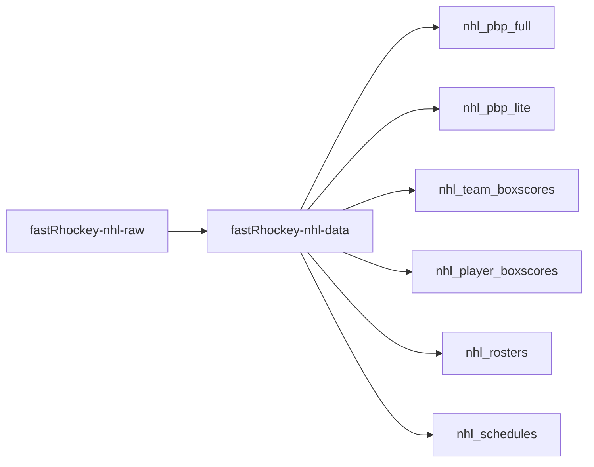
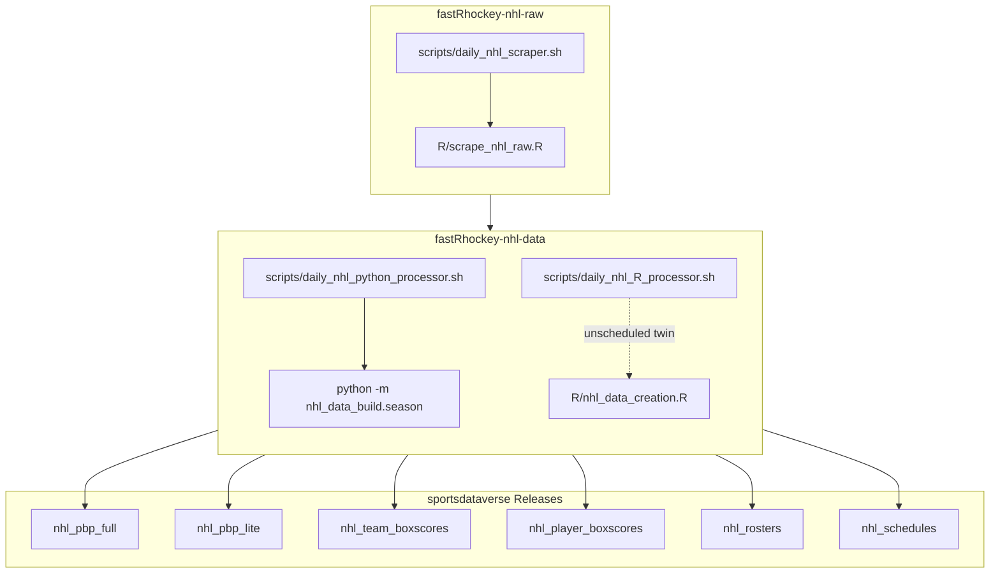

# fastRhockey-nhl-raw

Raw NHL game JSON data scraped from the NHL API via [fastRhockey](https://github.com/sportsdataverse/fastRhockey).



## fastRhockey NHL workflow diagram



## sportsdataverse-data releases

| Release tag | Content |
|-----|---------|
| [`nhl_pbp_full`](https://github.com/sportsdataverse/sportsdataverse-data/releases/tag/nhl_pbp_full) | NHL play-by-play data (full, includes shifts) |
| [`nhl_pbp_lite`](https://github.com/sportsdataverse/sportsdataverse-data/releases/tag/nhl_pbp_lite) | NHL play-by-play data (lite, no shift CHANGE events) |
| [`nhl_team_boxscores`](https://github.com/sportsdataverse/sportsdataverse-data/releases/tag/nhl_team_boxscores) | NHL team box scores |
| [`nhl_player_boxscores`](https://github.com/sportsdataverse/sportsdataverse-data/releases/tag/nhl_player_boxscores) | NHL player box scores (skaters + goalies) |
| [`nhl_rosters`](https://github.com/sportsdataverse/sportsdataverse-data/releases/tag/nhl_rosters) | NHL rosters |
| [`nhl_schedules`](https://github.com/sportsdataverse/sportsdataverse-data/releases/tag/nhl_schedules) | NHL schedules |

## Structure

```
nhl/
├── json/
│   ├── raw/              # Raw NHL API responses per game
│   └── final/            # Processed via fastRhockey pipeline (PBP, box scores, game info)
├── schedules/
│   ├── rds/              # Season schedules (nhl_schedule_{year}.rds)
│   └── parquet/          # Season schedules in parquet format
├── nhl_schedule_master.rds       # Combined schedule across all seasons
└── nhl_schedule_master.parquet
```

## Reports & explainers

<!-- BEGIN GENERATED: reports -->

| Report | What it is | Last updated |
|---|---|---|
| _none yet_ | — | — |

<!-- END GENERATED: reports -->

## Automation & status

<!-- BEGIN GENERATED: status -->

| workflow | schedule | last run |
|---|---|---|
| [](https://github.com/sportsdataverse/fastRhockey-nhl-raw/actions/workflows/fastRhockey_nhl_data_trigger.yml) | on push / dispatch | 2026-07-22 |
| [](https://github.com/sportsdataverse/fastRhockey-nhl-raw/actions/workflows/orphan_scripts.yml) | on push / PR / dispatch | 2026-08-19 |
| [](https://github.com/sportsdataverse/fastRhockey-nhl-raw/actions/workflows/scrape_nhl_raw.yml) | daily 08:00 UTC in Oct-Dec; daily 08:00 UTC in Jan-Apr; daily 08:00 UTC in May-Jun | 2026-07-18 |
| [](https://github.com/sportsdataverse/fastRhockey-nhl-raw/actions/workflows/tests.yml) | on push / PR / dispatch | 2026-08-19 |

<!-- END GENERATED: status -->
- **Scraping workflow** runs daily during the NHL season
- On push, triggers the [fastRhockey-nhl-data](https://github.com/sportsdataverse/fastRhockey-nhl-data) repo to compile datasets

## Related repositories

[fastRhockey-nhl-raw data repository (source: NHL API)](https://github.com/sportsdataverse/fastRhockey-nhl-raw)

[fastRhockey-nhl-data repository (source: NHL API)](https://github.com/sportsdataverse/fastRhockey-nhl-data)

[fastRhockey-pwhl-raw data repository (source: HockeyTech API)](https://github.com/sportsdataverse/fastRhockey-pwhl-raw)

[fastRhockey-pwhl-data repository (source: HockeyTech API)](https://github.com/sportsdataverse/fastRhockey-pwhl-data)

[fastRhockey-data legacy repository (archived; sources: NHL Stats API + PHF)](https://github.com/sportsdataverse/fastRhockey-data)

## Part of the [SportsDataverse](https://sportsdataverse.org/)

## Consumers

The packages that read what this repo produces:

- **R:** [fastRhockey](https://fastRhockey.sportsdataverse.org) — docs at <https://fastRhockey.sportsdataverse.org>
- **Python:** [`sportsdataverse.nhl`](https://github.com/sportsdataverse/sportsdataverse-py) — docs at <https://py.sportsdataverse.org>

## Stage inventory

Every numbered pipeline stage in `python/` (auto-listed; run subsets with the `scripts/*.sh` drivers by number or name):

- `python/nhl_raw_01_scrape.py`
